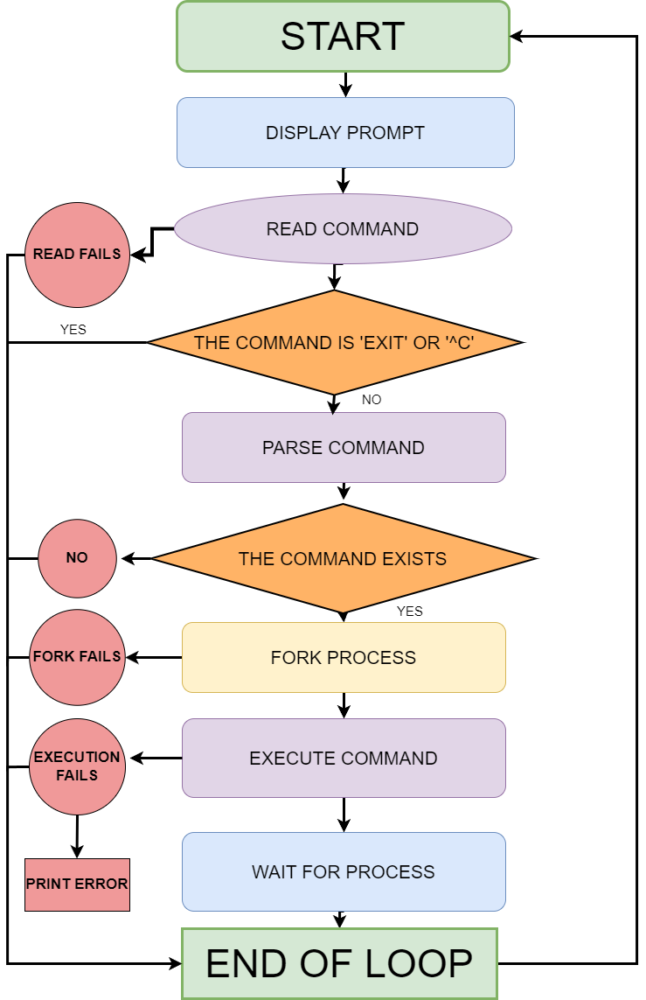

# ./hsh

## DESCRIPTION
*A simple shell is a minimalist command interpreter focused on executing essential tasks such as process management and command execution. Its streamlined design makes it ideal for environments where simplicity and efficiency are prioritized.*

## INSTALLATION
git clone https://github.com/dosleam/holbertonschool-simple_shell.git

## COMPILATION
To compile this project, use the following command:  
*'gcc -Wall -Werror -Wextra -pedantic -std=gnu89 *.c -o hsh'*

## REQUIREMENTS
- Allowed editors: vi, vim, emacs
- All your files will be compiled on Ubuntu 20.04 LTS using gcc, using the options -Wall -Werror -Wextra -pedantic -std=gnu89
- All your files should end with a new line
- A README.md file, at the root of the folder of the project is mandatory
- Your code should use the Betty style. It will be checked using betty-style.pl and betty-doc.pl
- Your shell should not have any memory leaks
- No more than 5 functions per file
- All your header files should be include guarded
- Use system calls only when you need to

## AUTHORIZED FUNCTIONS
- all functions from string.h
- access
- chdir
- close
- closedir
- execve
- exit
- _exit
- fflush
- fork
- free
- getcwd
- getline
- getpid
- isatty
- kill
- malloc
- open
- opendir
- perror
- printf
- fprintf
- vfprintf
- sprintf
- putchar
- read
- readdir
- signal
- stat (__xstat)
- lstat (__lxstat)
- fstat (__fxstat)
- strtok
- wait
- waitpid
- wait3
- wait4
- write

## EXAMPLES OF USES
Here are some usage examples:

Ready ($) ls 
AUTHORS    execute_command.c   get_command_path.c  hsh     main.h              parse_command.c
README.md  execute_pipeline.c  handle_command.c    main.c  man_1_simple_shell  shell_loop.c 
Ready ($) ls -l 
total 64 
-rw-r--r-- 1 root root   150 Aug 22 07:37 AUTHORS 
-rw-r--r-- 1 root root  1790 Aug 22 12:24 README.md 
-rw-r--r-- 1 root root   970 Aug 22 12:25 execute_command.c 
-rw-r--r-- 1 root root  1604 Aug 22 08:18 execute_pipeline.c 
-rw-r--r-- 1 root root  1504 Aug 22 12:25 get_command_path.c 
-rw-r--r-- 1 root root   629 Aug 22 08:18 handle_command.c 
-rwxr-xr-x 1 root root 17624 Aug 22 12:25 hsh 
-rw-r--r-- 1 root root   305 Aug 22 08:18 main.c 
-rw-r--r-- 1 root root   551 Aug 22 08:19 main.h 
-rw-r--r-- 1 root root   942 Aug 22 08:18 man_1_simple_shell 
-rw-r--r-- 1 root root   641 Aug 22 08:18 parse_command.c 
-rw-r--r-- 1 root root   557 Aug 22 08:18 shell_loop.c 
Ready ($) exit

## TESTING
To test the implementation. Compile and run it as follows:  
'gcc -Wall -Werror -Wextra -pedantic -std=gnu89 *.c -o hsh'
`./hsh`

## FLOWCHART

## AUTHORS
This project was made by Mariama Goudiaby and Jeremy Sousa.